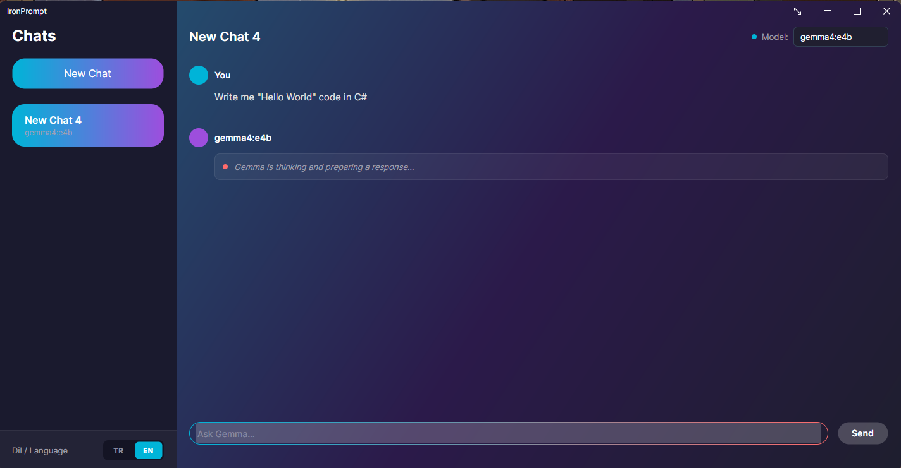
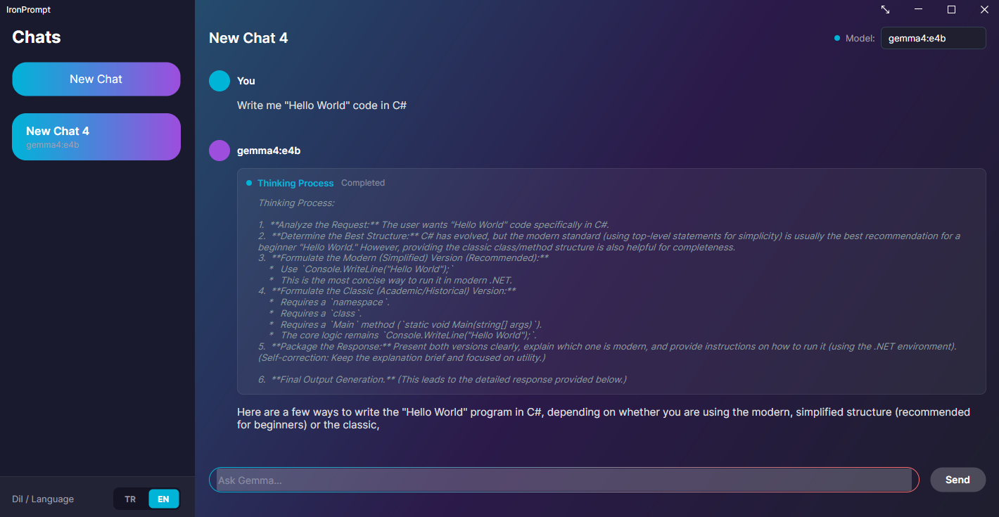
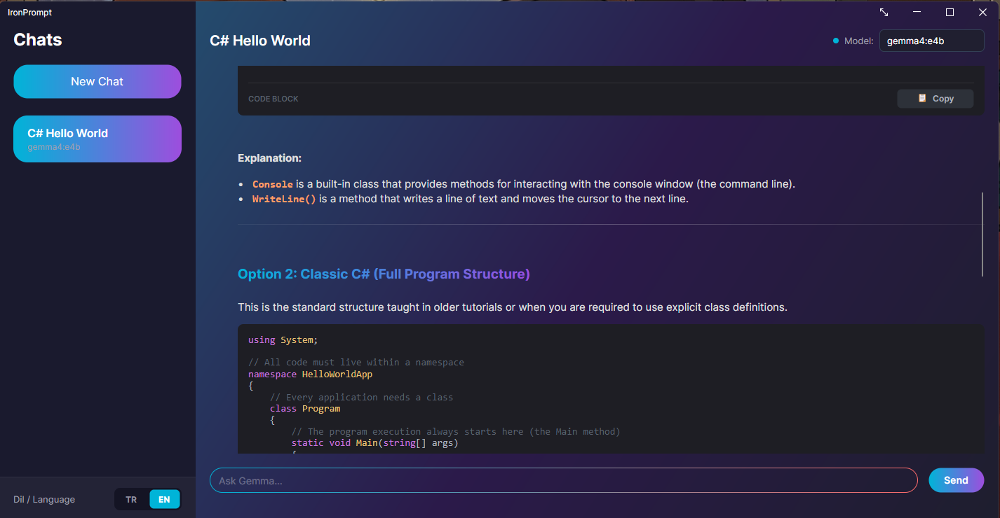
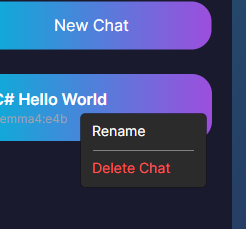

# IronPrompt

[](https://dotnet.microsoft.com/)
[](https://avaloniaui.net/)
[](#native-aot-compilation)
[](LICENSE)

**IronPrompt** is a sleek, state-of-the-art desktop client for interacting with local Ollama LLMs. Designed with modern aesthetics and premium glassmorphism in mind, it provides a fast, tactile, and highly responsive user experience. 

It is fully optimized for **.NET 10** and built from the ground up to support **100% Native AOT (Ahead-of-Time)** compilation, achieving near-instantaneous startup times and minimum memory footprints.

---

## Key Features

*   **Premium Glassmorphism UI**: Harmony-driven dark mode color palette (`#101018` base) styled with smooth gradient buttons, semi-transparent panels, and subtle micro-animations.
*   **Dynamic Localization (TR / EN)**: Hot-swappable language support in Turkish and English via a custom segmented toggle at the bottom of the sidebar. All static texts, placeholders, and error dialogs translate instantly without app restarts.
*   **Advanced Markdown Parsing**: Renders headers, lists, bullet points, horizontal dividers, inline code blocks, and bold/italic styles natively.
*   **Rich Interactive Tables**: Beautifully structured grid-based markdown table viewer featuring alternate-row tinting and auto-scaling columns.
*   **Smart Code Blocks**: High-tech syntax highlighting wrapper with a one-click copy button and smooth horizontal scrolling.
*   **Thinking Process Visualization**: Specialized glows and visual steps representing deep-thinking states (e.g. `<think>` blocks in reasoning models), keeping track of active thoughts vs completed responses.
*   **Ollama Chat Integration**: Full-duplex streaming API support over local endpoints (`http://localhost:11434/api/chat`).
*   **Session & Boundaries Persistence**: Remembers window bounds (Width, Height, position coordinates, and WindowState), language selection, scroll positions, and chat history.

---

## Technical Architecture

*   **Framework**: .NET 10 & Avalonia UI (MVVM)
*   **Code Generation**: Utilizes source generators (`CommunityToolkit.Mvvm`) for reactive bindings.
*   **JSON Serialization**: Configured using compile-time source-generated JSON reflection contexts (`System.Text.Json.Serialization.JsonSerializerContext`) to ensure full Native AOT compatibility.

---

## Getting Started

### Prerequisites (For Everyone)

*   **Ollama**: Ensure Ollama is installed and running locally on your machine:
    ```bash
    ollama run gemma4:e4b # Or any model of your choice (e.g. gemma4:26b)
    ```

### Option 1: Quick Start (For General Users)

Because **IronPrompt** is compiled as a **Native AOT self-contained application**, it runs 100% independently on Windows. You **do not need** to install .NET 10 SDK, .NET Runtimes, or any other external frameworks!

1.  Go to the [Releases](https://github.com/your-username/IronPrompt/releases) page.
2.  Select your preferred distribution format:
    *   **Standard Installer (`IronPromptSetup.exe`)**: A professional installer wizard that automatically installs the program, registers shortcuts, and creates a Start Menu entry for easy access.
    *   **Portable Archive (`IronPrompt-win-x64.zip`)**: A standalone, lightweight package. Simply extract the ZIP file anywhere on your system and run `IronPrompt.exe` immediately without installation.

### Option 2: Build & Run from Source (For Developers)

If you want to compile the project yourself or contribute to the codebase:

1.  **Install .NET 10 SDK**: [Download .NET 10 SDK](https://dotnet.microsoft.com/download)
2.  Clone the repository:
    ```bash
    git clone https://github.com/arda-ceylan/IronPrompt.git
    cd IronPrompt
    ```
3.  Run the application using the dotnet CLI:
    ```bash
    dotnet run --project IronPrompt/IronPrompt.csproj
    ```

---

## Native AOT Compilation

To publish the application as a single-file, self-contained native executable with maximum optimization and no external dependencies:

```bash
dotnet publish IronPrompt/IronPrompt.csproj -c Release -r win-x64 --self-contained true
```

*The resulting executable will be generated under `bin\Release\net10.0\publish\win-x64\`.*

---

## Screenshots

<p align="center">
  <table align="center" border="0" cellpadding="5" cellspacing="5" style="border-collapse: collapse;">
    <tr>
      <td align="center" width="50%" valign="top" style="border: none;">
        
        <br/>
        <sub><b>Figure 1:</b> Main chat view featuring the custom TR/EN segmented switch and dark glassmorphism.</sub>
      </td>
      <td align="center" width="50%" valign="top" style="border: none;">
        
        <br/>
        <sub><b>Figure 2:</b> Interactive deep thinking reasoning step visualization and syntax-highlighted code blocks.</sub>
      </td>
    </tr>
    <br/>
    <tr>
      <td align="center" width="50%" valign="top" style="border: none;">
        
        <br/>
        <sub><b>Figure 3:</b> Complete, seamless dynamic English UI translation in action across all controls.</sub>
      </td>
      <td align="center" width="50%" valign="top" style="border: none;">
        
        <br/>
        <sub><b>Figure 4:</b> Tactile chat session control with dynamic inline rename and right-click delete options.</sub>
      </td>
    </tr>
  </table>
</p>

---

## License

Copyright © 2026 **Arda Ceylan**. All rights reserved.

Licensed under the **Apache License, Version 2.0** (the "License"). You may obtain a copy of the License in the [LICENSE](LICENSE) file or at:

[http://www.apache.org/licenses/LICENSE-2.0](http://www.apache.org/licenses/LICENSE-2.0)
